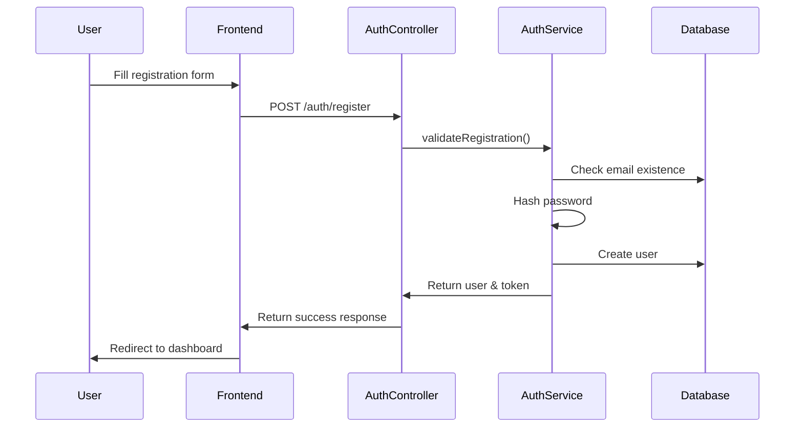
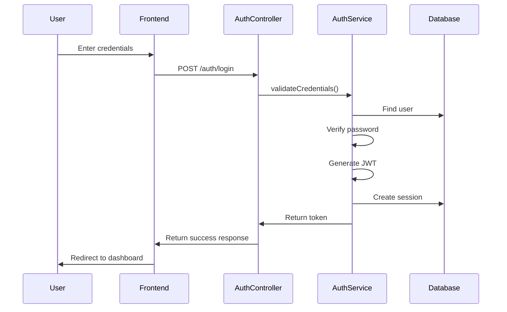

# Authentication Flow

## User Authentication Process

### 1. Registration Flow


### 2. Login Flow


## Implementation Details

### Password Security
- Passwords are hashed using bcrypt with a salt round of 10
- Minimum password requirements:
  - At least 8 characters
  - Must contain at least one uppercase letter
  - Must contain at least one number
  - Must contain at least one special character

### JWT Token Structure
```typescript
interface JWTPayload {
  userId: string;
  email: string;
  role: UserRole;
  companyId: string;
  teamId: string;
  sessionId: string;
  iat: number;
  exp: number;
}
```

### Session Management
- Sessions are stored in the database
- Each login creates a new session
- Sessions include:
  - User ID
  - Device information
  - IP address
  - Last active timestamp
  - Expiration time

## Test Cases

### Registration Tests
1. Valid registration with all required fields
2. Duplicate email registration attempt
3. Invalid password format
4. Missing required fields
5. Company and team assignment

### Login Tests
1. Valid credentials login
2. Invalid password attempt
3. Non-existent user login attempt
4. Account lockout after multiple failures
5. Session creation verification

### Password Reset Tests
1. Password reset request flow
2. Reset token validation
3. New password update
4. Invalid token handling
5. Expired token handling
